* 實驗設定

* work graphs
    * overview
        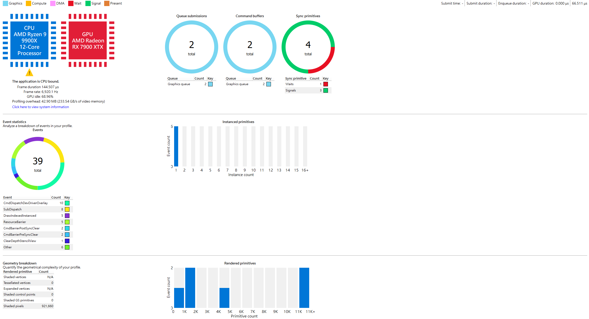
    * wavefront
        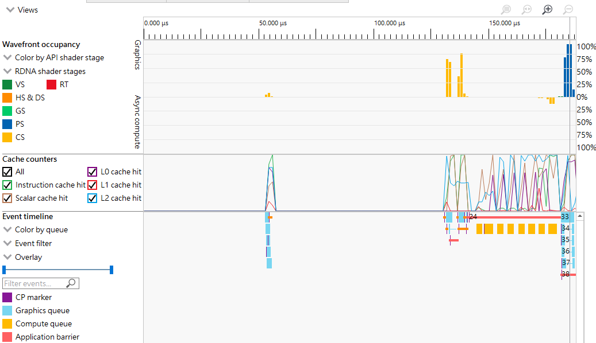
    * only 1 wavefront at beginning
        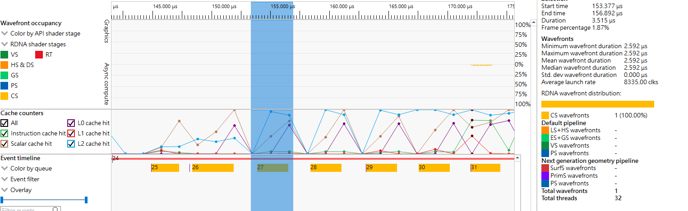
    * wavefront - select compute
        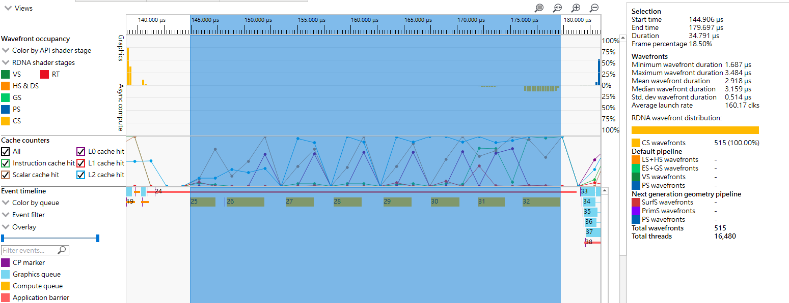
    * overview - depth 8
        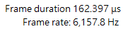
    * wavefront - depth 8
        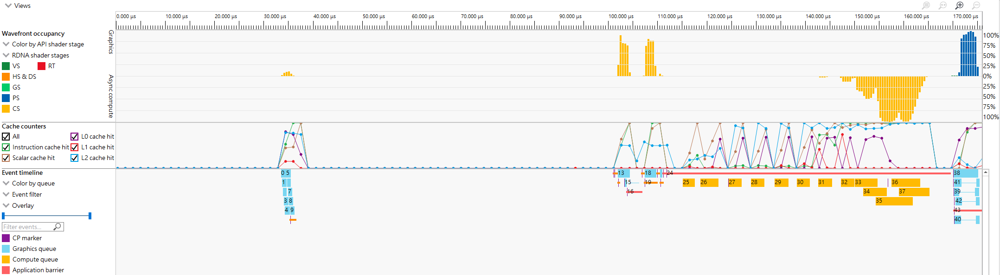
    * wavefront - depth 8 select compute
        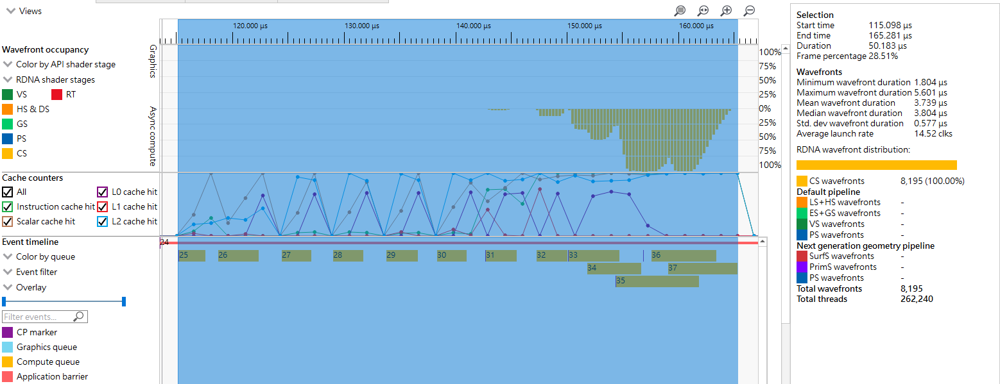

* vulkan persistent thread
    * overview
        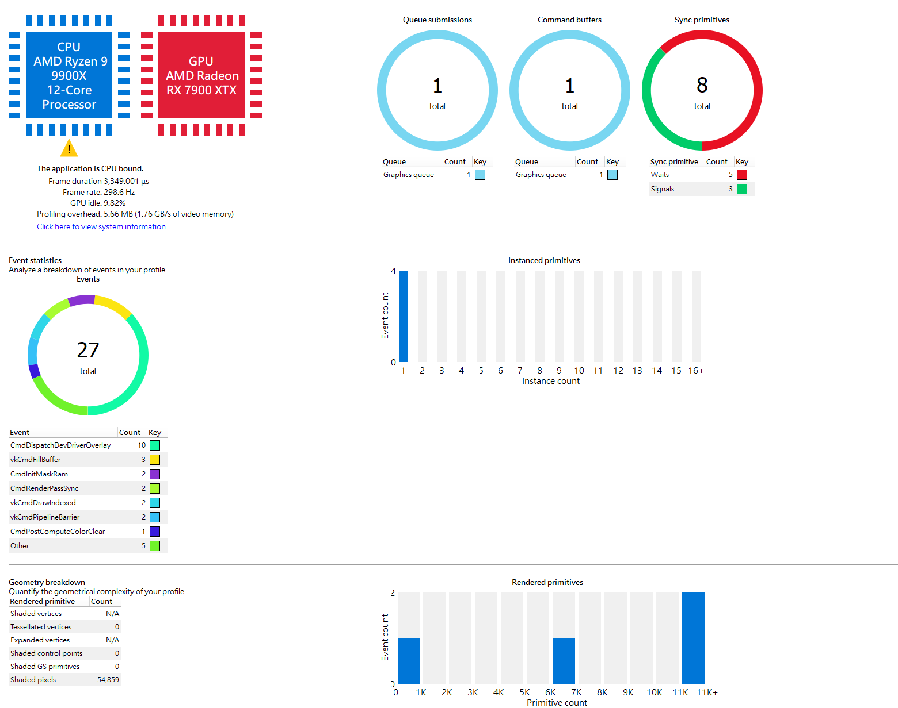
    * wavefront
        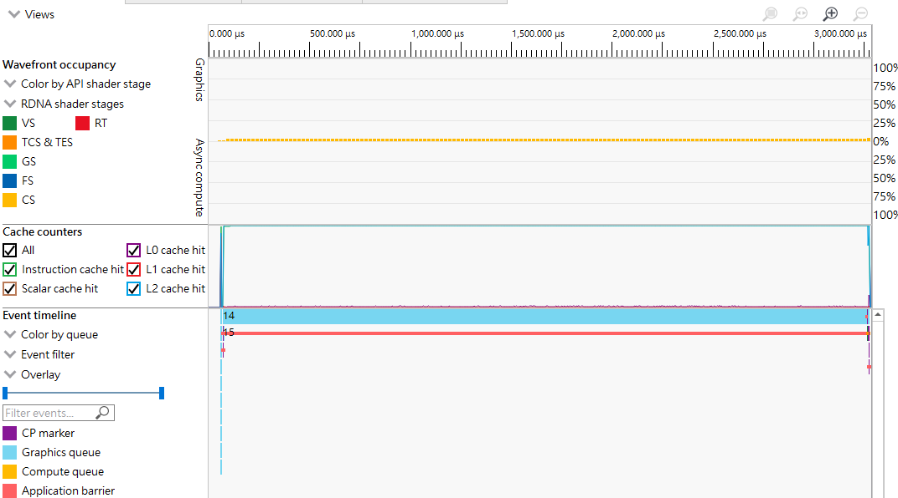
    * wavefront - select compute
        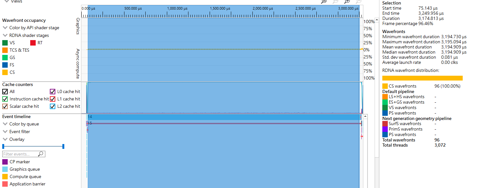
    * overview - depth 8
        
    * wavefront - select compute - depth 8
        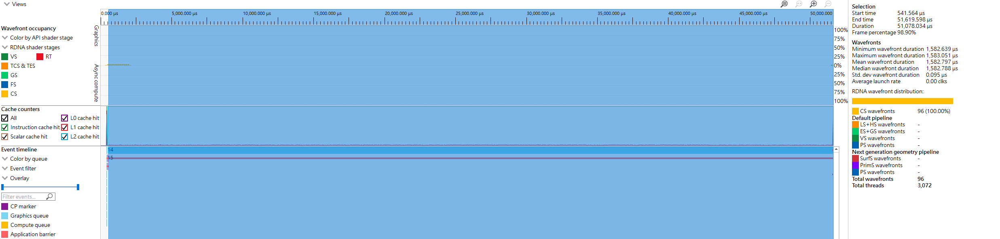
    * depth 8, no active wavefront but lots of r/w
        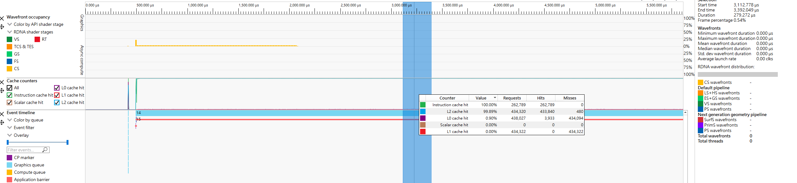
    * depth 8， 3072 group, overview
        
    * depth 8, 3072 group, wavefront
        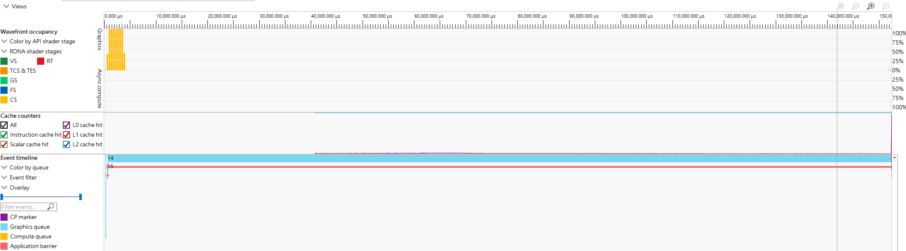
    * depth 8, 3072 group, reverse node b c ratio, overview
        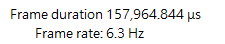
    * depth 8, 3072 group, reverse node b c ratio, wavefront
        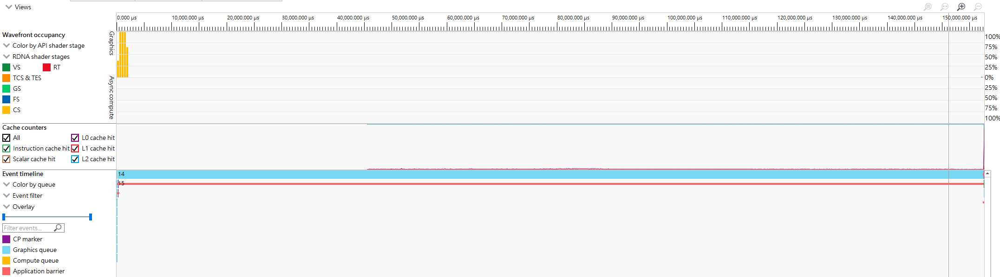

## Profile summary table

| 組別 | FPS | duration | compute duration |
|---|---:|---:|---:|
| wg | 6,920.1 Hz | 144.507 us | 34.791 us |
| pt-96 | 298.6 Hz | 3,349.001 us | 3,174.813 us |
| wg8 | 6,157.8 Hz | 162.397 us | 50.183 us |
| pt8-96 | 19.5 Hz | 51,407.951 us | 51,078.034 us |
| pt8-96x32 | 6.5 Hz | 153,038.548 us | N/A |
| pt8-96x32-reverse-worker | 6.3 Hz | 157,964.844 us | N/A |

Note: `compute duration` is read from the right-side Selection `Duration` field in the select-compute screenshots. `pt8-96x32` and `pt8-96x32-reverse-worker` only have wavefront screenshots in this Markdown, so their compute duration is not recorded here.

## Profile 數據整理

| 方法 | 圖片來源 | Frame duration | FPS / frame rate | 備註 |
|---|---:|---:|---:|---|
| Work Graphs | `assets/profile/image-3.png` | 144.507 us | 6,920.1 Hz | baseline |
| Vulkan persistent thread | `assets/profile/image-4.png` | 3,349.001 us | 298.6 Hz | GPU 持續執行時間明顯較長 |

* 爲什麽 work graphs 一開始只有 1 個 wavefront? trace code 來回答我

* persistent thread 版本裏面， wavefront 一直沒有變，是不是代表只要 persistent thread alive 就會被算作 active wave? 如果是如此，那麽我們 dispatch 的 workgroup 數量
* --> 實驗，
