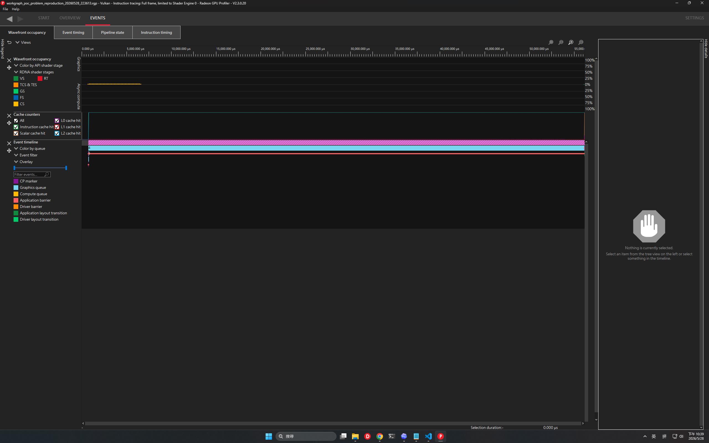
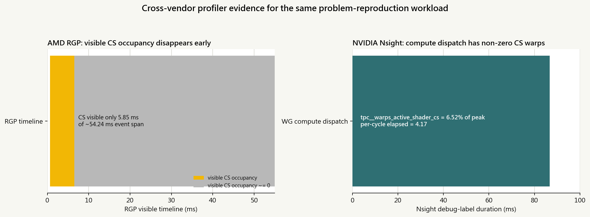

# RDP/RGP wavefront=0 現象跨 GPU 對照實驗報告

日期：2026-05-28  
分支：`experiment/rgp-nsight-occupancy`  
報告目的：確認 `workgraph_vulkan_poc` 的 RDP/RGP `wavefront occupancy ~= 0` 是否能重現，並用 NVIDIA Nsight GPU Trace 做同 workload 對照。

## 結論

1. AMD RX 7900 XTX + RDP/RGP 上，`problem_reproduction` workload 已在新 trace 中重現：RGP `Wavefront occupancy` 視圖只在前段約 5.85 ms 有可見 CS occupancy，之後到約 55.00 ms 的事件尾端幾乎顯示為 0。
2. NVIDIA RTX 2080 + Nsight Graphics 2026.2.0 上，同一組 workload 沒有出現「active CS warps 全程為 0」：`WG compute dispatch` duration 為 86.74 ms，`tpc__warps_active_shader_cs_realtime.avg.pct_of_peak_sustained_elapsed` 為 6.52%。
3. 目前比較支持的結論不是「shader 真的沒有 wavefront」，而是：AMD RGP 這個 Wavefront occupancy view 不能當作 full-GPU execution/completion 的單一證據。特別是本次 RGP 標題列顯示 `Instruction tracing: Full frame, limited to Shader Engine 0`。
4. 處置建議：後續報告中可以繼續忽略 RGP `wavefront=0` 作為效能瓶頸判據，但措辭應改成「RGP occupancy view 在此 workload / capture scope 下不可靠或不完整」，不要泛化成「RDP/RGP 全部不準」。

## 原始脈絡

原始 deck 第 6 頁：Vulkan Persistent Thread WorkGraph POC / RDP/RGP occupancy validation / 06 / Wavefront-only RGP crop / 這張圖可以輔助觀察，但不能單獨當因果證據。 / wavefront = 0 / 不能直接推論 shader 已結束 / • / RGP occupancy 圖保留作輔助。 / • / ALU-only probe 也出現相似型態。 / • / 後續判斷主要依據：compute time 與 queue counters trend。 / 這頁只交代 profiler 解讀邊界，不展開細節。 / 2026 / 05 / 25 / Optimization Evaluation

原本 deck 的重點是「這張圖只能輔助觀察，不能單獨當因果證據」。本次實驗把這點補強成跨 profiler 對照。

## workload 與控制條件

問題重現組：

```text
--resourcepath <repo-or-package-root> --gpu 0
--benchmark --benchwarmup 0 --width 640 --height 480
--wg-no-metrics
--wg-queue-shards 1 --wg-q2-shards 1
--wg-node-c-start 72
--wg-no-q1-lane-pop --wg-no-q2-deq-batch
```

注意：本報告不使用 duration 作為最佳化結論。duration 只用來確認 profiler trace 覆蓋的 dispatch span 與 debug-label 區間，因為 RGP/Nsight instrumentation 會改變時間。

## 關鍵證據



AMD RGP 截圖量化結果：

| 指標 | 數值 |
|---|---:|
| RGP 可見時間軸 | 55.00 ms |
| CS occupancy 可見非零區間 | 0.67 - 6.51 ms |
| CS occupancy 可見非零長度 | 5.85 ms |
| event overlay span | 54.24 ms |
| event 後段但 CS occupancy 近 0 的可見區間 | 48.49 ms |
| CS 可見非零比例 | 10.78% |



NVIDIA Nsight GPU Trace 自動匯出的 `WG compute dispatch` 關鍵欄位：

| 欄位 | 數值 |
|---|---:|
| `time_ms` | 86.7386 |
| `gpu__engine_cycles_active_gr_or_ce` | 99.996% |
| `gr__dispatch_cycles_active_queue_sync` | 99.9822% |
| `tpc__warps_active_shader_cs_realtime` | 6.5189% |
| `tpc__warps_active_shader_cs_realtime.avg.per_cycle_elapsed` | 4.1721 |

## 觀察、假設、結論分離

觀察：

- AMD RGP 新 trace 成功擷取，`Wavefront occupancy` 畫面重現「大部分 compute/event span 內 CS occupancy 近 0」。
- 同一問題重現 workload 在 NVIDIA Nsight GPU Trace 中，`WG compute dispatch` 有非零 CS active warps。
- AMD app metrics 與 NVIDIA app metrics 都維持 deterministic output：`edges=196608`、`vertices=393216`。

假設：

- AMD RGP 的現象可能來自 capture / instruction tracing scope，尤其標題列明示 limited to Shader Engine 0。
- 也可能與 RGP 對 persistent-thread / long-running compute 的 sampling 或 visualization 有關。

結論：

- `wavefront=0` 現象在 AMD/RGP 可以重現。
- 本次 NVIDIA/Nsight 對照沒有重現「active compute warps 全為 0」。
- 因此它不是足以證明 shader 已結束或 GPU 沒有 active compute work 的證據。

## 限制

- AMD RGP 的數值是從截圖像素量化，因為 RGP GUI 沒有在本次流程中提供可匯出的 wavefront occupancy 數字。
- RGP trace title 明示只限 Shader Engine 0；因此這個 view 不等於 full-chip occupancy。
- NVIDIA RTX 2080 是 Turing，Nsight CLI 顯示 HES 不支援；部分 SM throughput / instruction fields 為 0，本報告只使用 debug-label duration 與 `tpc__warps_active_shader_cs_realtime` 作為對照。
- NVIDIA GUI 截圖開啟不穩，但 CLI trace 與 auto-export 成功；本報告以 export 表格與 `.ngfx-gputrace` 檔案作為主要 Nsight 證據。
- 跨 GPU 對照不能證明 AMD hardware counter 的 ground truth，只能證明「同類 workload 在 Nsight 不呈現全零 active CS warps」。

## 附錄資料

| 類別 | 路徑 |
|---|---|
| AMD RGP trace | `amd_rgp/traces/workgraph_poc_problem_reproduction_20260528_223613.rgp` |
| AMD RGP key screenshot | `amd_rgp/amd_rgp_wavefront_occupancy_problem_overview.png` |
| AMD screenshot pixel summary | `amd_rgp/amd_rgp_wavefront_pixel_summary.csv` |
| AMD app metrics | `amd_rgp/metrics_summary.csv` |
| NVIDIA Nsight trace | `nvidia_nsight_trace/workgraph_poc_2026_05_28_22_42_19.ngfx-gputrace` |
| NVIDIA Nsight raw export | `nvidia_nsight_trace/BASE/*.xls` |
| NVIDIA regime summary | `nvidia_nsight_trace/nvidia_gpu_trace_regime_summary.csv` |
| NVIDIA app metrics | `nvidia_nsight/metrics_summary.csv` |
| environment records | `appendix/amd_environment_20260528.txt`, `appendix/nvidia_environment_20260528.txt` |
| rerun scripts | `scripts/*.ps1`, `scripts/generate_wavefront_report_20260528.py` |

## 參考

- NVIDIA Nsight Graphics User Guide - GPU Trace：<https://docs.nvidia.com/nsight-graphics/UserGuide/gpu-trace-overview.html>
- NVIDIA Nsight Graphics User Guide - command line options：<https://docs.nvidia.com/nsight-graphics/UserGuide/index.html>
- GPUOpen Radeon GPU Profiler documentation：<https://gpuopen.com/rgp/>
